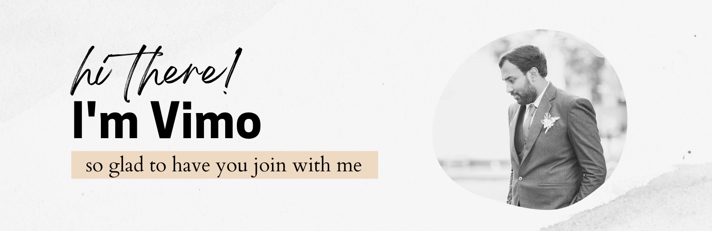

# Hi, I'm Vimukthi Gunasekara 👋🏾 👩🏾‍💻

I'm a software engineer who is passionate about making contributing to open-source more approachable, creating technology to elevate people, and building community. Some technologies I enjoy working with include ReactJS, Jamstack (JavaScript, APIs + Markup) and GraphQL. In 2020, I was selected to be an inaugural <a href="https://stars.github.com/">GitHub Star 🌟</a> based on my involvement in the tech community.  My interest in the React ecosystem led me to launch <a href="https://www.reactrobins.com/">React Robins</a>, a community for women and non-binary ReactJS developers.

## Find me around the web 🌎: 
Sharing updates on <a href="https://www.linkedin.com/in/vimukthi-gunasekara/">LinkedIn</a> 💼 <a href="https://twitter.com/Vimu_Gunasekara">Twitter</a> 🐦<a href="https://about.me/VimukthiGunasekara/">AboutMe</a> 🧔

Originally from my GitHub:  
<https://github.com/VimukthiGunasekara/>
